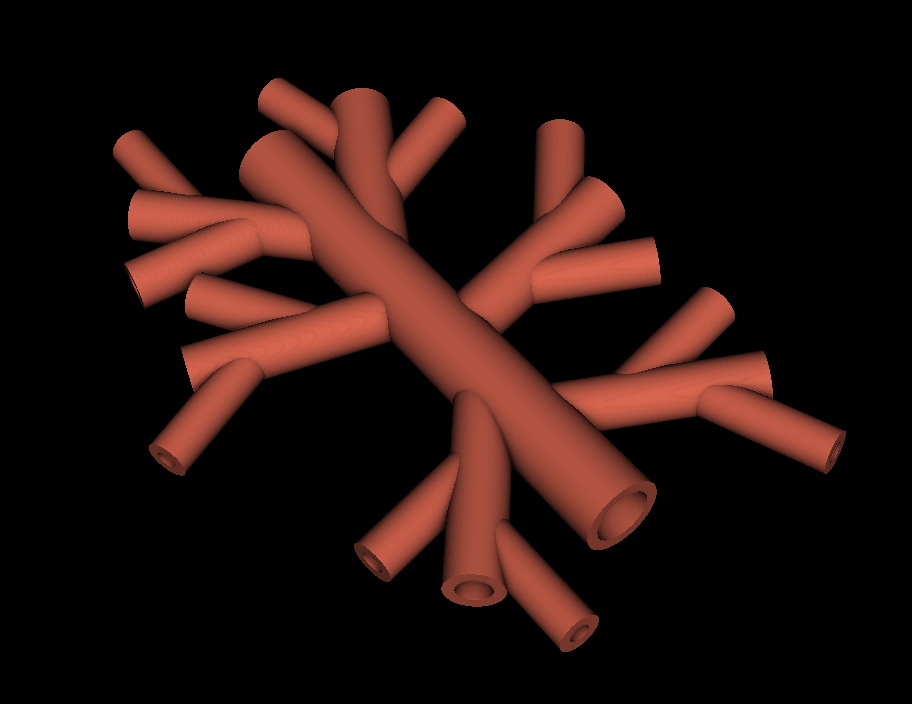

# Vascular Tree Model Generator

This repository generates a **3D printable vascular tree STL** using **CadQuery**.  
The geometry is driven by **JSON configuration files** (in `configs/`), so you can swap vessel layouts without touching the Python code.



## What it builds

- **Main branch** (a cylinder)
- **Primary branches** attached along the main branch (angles/positions/diameters configurable)
- Optional **secondary branches** (2 per primary branch)
- Optional **adapter** section (enabled/disabled via config)
- Optional **junction rounding** (fillet on intersection seams; avoids rounding cylinder rims)

The script also generates and subtracts **lumen holes** so the result is a hollow vessel network rather than intersecting solids.

## Features

- JSON-driven configuration (`configs/*.json`)
- Primary + optional secondary branching
- Optional adapter (`add_adapter`)
- Optional interior/exterior organic rounding (`rounding`)
- STL export to `output/`

## Requirements

- Python (CadQuery version decides exact Python requirement; **Python 3.9+ recommended**)
- [CadQuery](https://cadquery.readthedocs.io/en/latest/)

## Installation

```bash
git clone <repository_url>
cd <repository_name>

python -m venv .venv
source .venv/bin/activate

pip install cadquery
```

## Repository structure

```text
.
├── generate_vessel_tree.py
├── configs/
│   ├── vascular_tree_default.json
│   └── vascular_tree_25mm.json
├── output/
└── data/
    └── vessel_example.png
```

## Usage

1. Pick or create a config in `configs/` (JSON).
2. Open `generate_vessel_tree.py` and set:

```python
CONFIG_FILE = "vascular_tree_25mm.json"
```

3. Run:

```bash
python generate_vessel_tree.py
```

4. Output is written to:

```text
output/<filename-from-config>.stl
```

## Configuration format (JSON)

A valid config looks like this (keys are in **mm** and **degrees**):

```json
{
  "main_branch_params": { "diameter": 25, "length": 180 },

  "primary_branch_params": {
    "angles": [120, -140, 80, -70, 30, -40],
    "relative_positions": [0.25, 0.35, 0.45, 0.55, 0.65, 0.75],
    "diameters": [8, 10, 13, 11, 18, 16],
    "length": 40
  },

  "secondary_branch_params": {
    "angles": [40, -40, 40, -40],
    "relative_positions": [0.4, 0.7, 0.7, 0.4],
    "diameters": [3, 2, 3, 4],
    "length": 40
  },

  "wall_thickness": 4,

  "add_adapter": false,
  "adapter_params": {
    "internal_diameter": 7,
    "external_diameter": 17,
    "length": 50
  },

  "add_secondary_branches": false,

  "rounding": {
    "external_intersection_rounding": 1.0,
    "external_micro_rounding": 0.5,
    "internal_intersection_rounding": 1.0,
    "internal_micro_rounding": 0.5
  },

  "output": { "folder": "output", "filename": "vascular_tree.stl" }
}
```

### Notes / constraints (important)

- `primary_branch_params.angles`, `relative_positions`, and `diameters` must have the **same length**.
- `relative_positions` are fractions of `main_branch_params.length` (0 → start, 1 → end).
- If `add_secondary_branches` is `true`, the script expects **2 secondary branches per primary**:
  - `len(secondary_branch_params.angles)` must be at least `2 * num_primary`.
  - Same for `secondary_branch_params.diameters` and `relative_positions`.
- If `add_adapter` is `false`, the script **skips** adapter geometry (cap/tube/lumen) even if `adapter_params` exists.
- Rounding radii are in **mm**. Set them to `0.0` to disable rounding.

## Output

The script generates:

- One STL file written to the folder specified by `output.folder`
- Filename specified by `output.filename`

## Customization

You can create multiple JSON presets in `configs/` and switch between them by changing `CONFIG_FILE`:

- Different vessel sizes (diameters/lengths)
- Different branching patterns (more/less primary branches, different angles)
- Enable/disable secondary branches
- Enable/disable adapter
- Tune wall thickness and rounding

## License

This project is licensed under the MIT License. See the `LICENSE` file for details.

## Acknowledgments

- Built using [CadQuery](https://cadquery.readthedocs.io/en/latest/), a Python-based parametric CAD library.